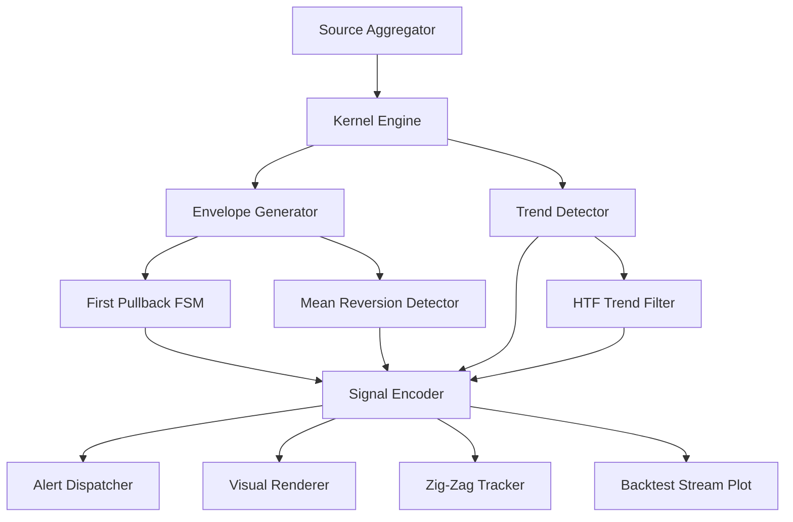
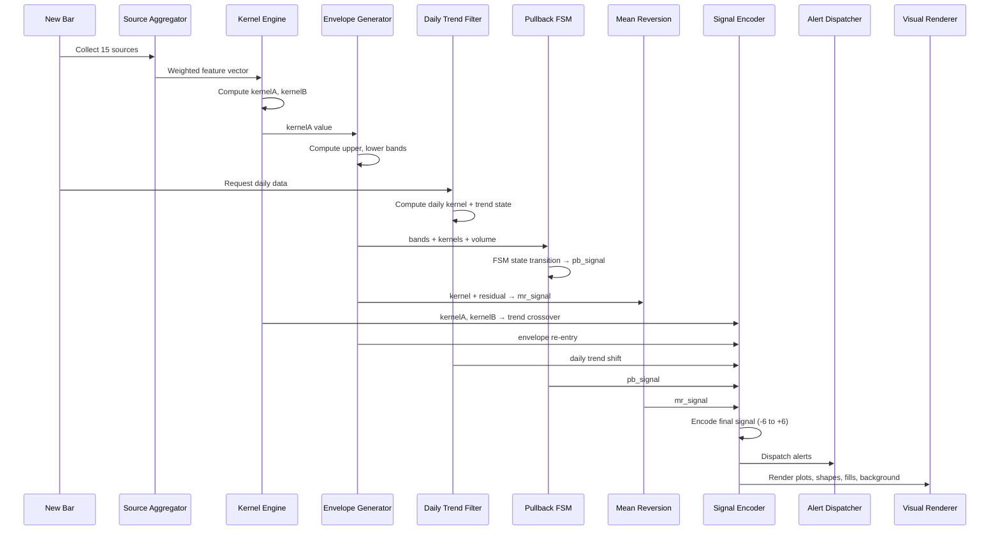

# Function Specification — AKRTS (PineScript v6)

## Module Architecture



---

## Module 1 — Source Aggregator

Normalizes and aggregates up to 15 input sources into a weighted feature vector for distance computation.

### `f_normalize(src, len) → float`

| Param | Type | Description |
|---|---|---|
| `src` | `series float` | Raw source series |
| `len` | `int` | Normalization lookback |
| **Returns** | `float` | Min-max normalized value in [0, 1] |

**Logic:** `(src - ta.lowest(src, len)) / (ta.highest(src, len) - ta.lowest(src, len) + 1e-10)`

---

### `f_weighted_feature_vector(sources, weights, norm_len) → float[]`

| Param | Type | Description |
|---|---|---|
| `sources` | `float[]` | Array of 15 source values (current bar) |
| `weights` | `float[]` | Array of 15 weights |
| `norm_len` | `int` | Normalization lookback |
| **Returns** | `float[]` | Weighted, normalized feature vector |

**Logic:**
1. For each source where `weight > 0`: normalize, then multiply by weight.
2. Return array of weighted values (skip zero-weight sources).

---

### `f_distance(vecA, vecB) → float`

| Param | Type | Description |
|---|---|---|
| `vecA` | `float[]` | Feature vector at bar A |
| `vecB` | `float[]` | Feature vector at bar B |
| **Returns** | `float` | Squared Euclidean distance (skip `sqrt` for performance) |

**Logic:** `Σ (vecA[j] − vecB[j])²` — no square root needed for relative ordering.

---

## Module 2 — Kernel Engine

Core Nadaraya-Watson kernel regression implementation with dual-kernel support.

### `f_kernel_weight_rq(dist_sq, bandwidth, alpha) → float`

| Param | Type | Description |
|---|---|---|
| `dist_sq` | `float` | Squared distance between bars |
| `bandwidth` | `float` | Bandwidth parameter h |
| `alpha` | `float` | Shape parameter α |
| **Returns** | `float` | Rational Quadratic kernel weight |

**Formula:** `math.pow(1.0 + dist_sq / (2.0 * alpha * bandwidth * bandwidth), -alpha)`

---

### `f_kernel_weight_gauss(dist_sq, bandwidth) → float`

| Param | Type | Description |
|---|---|---|
| `dist_sq` | `float` | Squared distance between bars |
| `bandwidth` | `float` | Bandwidth parameter h |
| **Returns** | `float` | Gaussian kernel weight |

**Formula:** `math.exp(-dist_sq / (2.0 * bandwidth * bandwidth))`

---

### `f_nadaraya_watson(src, lookback, kernel_type, bandwidth, alpha, downsample, reset_factor) → float`

| Param | Type | Description |
|---|---|---|
| `src` | `series float` | Price or derived source |
| `lookback` | `int` | Number of bars to look back |
| `kernel_type` | `string` | `"RQ"` or `"Gaussian"` |
| `bandwidth` | `float` | Kernel bandwidth |
| `alpha` | `float` | RQ alpha (ignored for Gaussian) |
| `downsample` | `int` | Evaluate every Nth bar (1 = all) |
| `reset_factor` | `float` | Memory decay factor (0–1) |
| **Returns** | `float` | Kernel regression estimate at current bar |

**Logic (Endpoint Estimation):**
```
sum_wy = 0.0
sum_w  = 0.0
for i = 0 to lookback - 1
    if i % downsample != 0 → continue          // downsampling
    decay = math.pow(reset_factor, i / lookback) // memory decay
    dist_sq = f_distance(current_vec, vec[i])
    w = kernel_func(dist_sq, bandwidth, alpha) * decay
    if w < 1e-10 → continue                     // lazy eval: skip negligible weights
    sum_wy += w * src[i]
    sum_w  += w
return sum_wy / (sum_w + 1e-10)
```

---

### `f_kernel_pair() → [kernelA, kernelB]`

Top-level wrapper. Calls `f_nadaraya_watson()` twice with Kernel A and Kernel B parameters. Returns both values.

---

## Module 3 — Envelope Generator

### `f_envelope(kernel_val, method, mult, atr_len) → [upper, lower]`

| Param | Type | Description |
|---|---|---|
| `kernel_val` | `float` | Kernel A regression value |
| `method` | `string` | `"ATR"` or `"StdDev"` |
| `mult` | `float` | Band multiplier |
| `atr_len` | `int` | ATR or StdDev lookback |
| **Returns** | `[float, float]` | Upper and lower band values |

**Logic:**
```
if method == "ATR"
    band_width = ta.atr(atr_len) * mult
else
    band_width = ta.stdev(close - kernel_val, atr_len) * mult
upper = kernel_val + band_width
lower = kernel_val - band_width
```

---

## Module 4 — First Pullback Finite State Machine

### State Enum

```
IDLE                  = 0
IMPULSE_DETECTED      = 1
PULLBACK_IN_PROGRESS  = 2
CONTINUATION_TRIGGERED = 3
COOLDOWN              = 4
```

### `f_first_pullback(close, upper, lower, kernelA, kernelB, vol, vol_sma, settings) → [signal, state]`

| Param | Type | Description |
|---|---|---|
| `close` | `float` | Current close |
| `upper` / `lower` | `float` | Envelope bands |
| `kernelA` / `kernelB` | `float` | Kernel values |
| `vol` | `float` | Current volume |
| `vol_sma` | `float` | Volume SMA |
| `settings` | `object` | Cooldown, vol_confirm, vol_mult |
| **Returns** | `[int, int]` | Signal (+4/−4 or 0), new state |

**State Transitions:**

| From | Condition | To |
|---|---|---|
| `IDLE` | Close breaks above `upper` AND (no vol_confirm OR vol > vol_sma × vol_mult) | `IMPULSE_DETECTED` (bullish) |
| `IDLE` | Close breaks below `lower` AND (no vol_confirm OR vol > vol_sma × vol_mult) | `IMPULSE_DETECTED` (bearish) |
| `IMPULSE_DETECTED` | Price retraces toward kernelA midline (bullish: close < prev_high; bearish: close > prev_low) | `PULLBACK_IN_PROGRESS` |
| `PULLBACK_IN_PROGRESS` | Price resumes impulse direction (bullish: close > swing_high; bearish: close < swing_low) | `CONTINUATION_TRIGGERED` → emit signal |
| `PULLBACK_IN_PROGRESS` | Price violates opposite band → impulse failed | `IDLE` |
| `CONTINUATION_TRIGGERED` | Immediately → | `COOLDOWN` |
| `COOLDOWN` | `cooldown_counter >= i_pb_cooldown` | `IDLE` |

---

## Module 5 — Mean Reversion Detector

### `f_mean_reversion(close, kernel_val, residual_len, reg_sigma, str_sigma, daily_trend, dtf_enabled) → [signal, tier]`

| Param | Type | Description |
|---|---|---|
| `close` | `float` | Current close |
| `kernel_val` | `float` | Kernel A estimate |
| `residual_len` | `int` | Residual StdDev lookback |
| `reg_sigma` | `float` | Regular tier threshold |
| `str_sigma` | `float` | Strong tier threshold |
| `daily_trend` | `int` | Daily filter state (+1/0/−1) |
| `dtf_enabled` | `bool` | Whether daily filter is active |
| **Returns** | `[int, int]` | Signal (+5/+6/−5/−6 or 0), tier (0/1/2) |

**Logic:**
```
residual = close - kernel_val
sigma    = ta.stdev(close - kernel_val, residual_len)
z_score  = residual / (sigma + 1e-10)

// Check if daily filter would suppress
if dtf_enabled AND daily_trend == +1 AND z_score > 0 → return 0  // don't short in bull trend
if dtf_enabled AND daily_trend == -1 AND z_score < 0 → return 0  // don't long in bear trend

if z_score <= -str_sigma → return [+6, 2]   // strong long
if z_score <= -reg_sigma → return [+5, 1]   // regular long
if z_score >= +str_sigma → return [-6, 2]   // strong short
if z_score >= +reg_sigma → return [-5, 1]   // regular short
return [0, 0]
```

---

## Module 6 — HTF Trend Filter

### `f_htf_trend_filter(res, lookback, bandwidth) → int`

| Param | Type | Description |
|---|---|---|
| `res` | `string` | HTF resolution (e.g., `"60"` for 1-hour) |
| `lookback` | `int` | HTF kernel lookback |
| `bandwidth` | `float` | HTF kernel bandwidth |
| **Returns** | `int` | `+1` (bullish), `0` (neutral), `−1` (bearish) |

**Logic:**
```
htf_close = request.security(syminfo.tickerid, res, close, lookahead=barmerge.lookahead_off)
htf_kernel = f_nadaraya_watson(htf_close, lookback, "RQ", bandwidth, 1.0, 1, 0.5)
htf_kernel_prev = htf_kernel[1]

slope = htf_kernel - htf_kernel_prev

if htf_close > htf_kernel AND slope > 0 → return +1
if htf_close < htf_kernel AND slope < 0 → return -1
return 0
```

---

## Module 7 — Signal Encoder

### `f_encode_signal(pb_signal, mr_signal, trend_signal, dtf_signal) → int`

Combines all sub-signals into a single **-6 to +6** integer using priority rules.

| Priority | Source | Values |
|---|---|---|
| 1 (highest) | Mean Reversion Strong | ±6 |
| 2 | Mean Reversion Regular | ±5 |
| 3 | First Pullback | ±4 |
| 4 | Kernel Crossover | ±3 |
| 5 | Envelope Re-entry | ±2 |
| 6 (lowest) | Daily Trend Shift | ±1 |

**Logic:** Return the highest-priority non-zero signal. If multiple fire on the same bar, the strongest signal wins.

---

### `f_trend_crossover(kernelA, kernelB) → int`

| Returns | Condition |
|---|---|
| `+3` | `ta.crossover(kernelA, kernelB)` |
| `−3` | `ta.crossunder(kernelA, kernelB)` |
| `0` | No cross |

---

### `f_envelope_reentry(close, upper, lower) → int`

| Returns | Condition |
|---|---|
| `+2` | `close[1] < lower[1] AND close >= lower` (bounce back inside from below) |
| `−2` | `close[1] > upper[1] AND close <= upper` (reject back inside from above) |
| `0` | No re-entry |

---

## Module 8 — Alert Dispatcher

### `f_dispatch_alerts(signal, pb_signal, mr_signal, mr_tier)`

Calls `alert()` with appropriate messages based on signal values. Maps each signal value to the corresponding Alert ID defined in the PRD §5.

**Implementation:** A series of `if` checks:
```
if pb_signal == +4
    alert("AKRTS: Bullish First Pullback on " + syminfo.ticker, alert.freq_once_per_bar)
if pb_signal == -4
    alert("AKRTS: Bearish First Pullback on " + syminfo.ticker, alert.freq_once_per_bar)
// ... etc for all signal types
```

Also registers `alertcondition()` for each signal type so users can configure alerts via TradingView UI.

---

## Module 9 — Visual Renderer

### `f_get_theme_colors(theme) → [bull, bear, neutral, kernelA, kernelB, bg_bull, bg_bear]`

Returns a color palette based on the selected theme. Supports: Default, Dark Mode, Light Mode, Colorblind Safe.

---

### Plot Outputs

| Plot ID | What | Display |
|---|---|---|
| `p_kernelA` | Kernel A line | Overlay, configurable color/width/style |
| `p_kernelB` | Kernel B line | Overlay, configurable color/width/style |
| `p_upper` | Upper envelope band | Overlay, semi-transparent |
| `p_lower` | Lower envelope band | Overlay, semi-transparent |
| `p_fill` | Fill between upper/lower | Gradient color based on trend |
| `p_pb_bull` | Pullback bullish triangle | `plotshape` ▲ below bar |
| `p_pb_bear` | Pullback bearish triangle | `plotshape` ▼ above bar |
| `p_mr_reg_long` | Regular MR long diamond | `plotshape` ◆ below bar |
| `p_mr_reg_short` | Regular MR short diamond | `plotshape` ◆ above bar |
| `p_mr_str_long` | Strong MR long diamond | `plotshape` ◆ below bar (larger) |
| `p_mr_str_short` | Strong MR short diamond | `plotshape` ◆ above bar (larger) |
| `p_signal_stream` | Backtest signal (-6 to +6) | Separate pane, `display.pane` |

### Background Highlight

```pinescript
bgcolor(htf_enabled AND htf_state == +1 ? color.new(bull_color, 92) :
        htf_enabled AND htf_state == -1 ? color.new(bear_color, 92) : na)
```

---

## Module 10 — Zig-Zag Tracker

Draws a line connecting major swing highs and lows to track market structure.

### `f_zigzag(length) → [float, int]`

| Param | Type | Description |
|---|---|---|
| `length` | `int` | Number of bars left and right to define a pivot |
| **Returns** | `float` | The price value of the most recent pivot |

**Logic:**
1. Use `ta.pivothigh(high, length, length)` and `ta.pivotlow(low, length, length)` to detect pivots.
2. Store the most recent pivot type and price in `var` variables.
3. Use PineScript `line.new()` arrays or drawing objects to connect the previous pivot coordinate to the current pivot coordinate.

---

## Module 11 — Advanced Training Helpers

### `f_downsample_kernel(src, lookback, downsample_n, ...) → float`

Wrapper around `f_nadaraya_watson` that passes `downsample = downsample_n`. Reduces the number of bars evaluated in the kernel loop by factor N.

---

### `f_remote_fractal_extend(base_lookback, remote_lookback, ...) → float`

Extends the kernel computation window beyond the normal lookback to capture long-range fractal structures.

**Logic:**
```
if i_adv_remote_frac
    effective_lookback = base_lookback + remote_lookback
else
    effective_lookback = base_lookback
return f_nadaraya_watson(src, effective_lookback, ...)
```

---

## Execution Flow (Per Bar)



---

## PineScript v6 Considerations

| Topic | Approach |
|---|---|
| **Bool strict mode** | All booleans explicitly `true`/`false`, no `na` checks on bool. |
| **Integer division** | Use `int()` or `math.floor()` when integer result needed. |
| **Dynamic `request.security()`** | Leverage v6's series-string support for dynamic timeframe if needed. |
| **Array negative indexing** | Use for convenience in lookback operations. |
| **`max_bars_back`** | Set on all series used in kernel loops to avoid runtime errors. |
| **Short-circuit evaluation** | Leverage for performance in conditional chains. |
