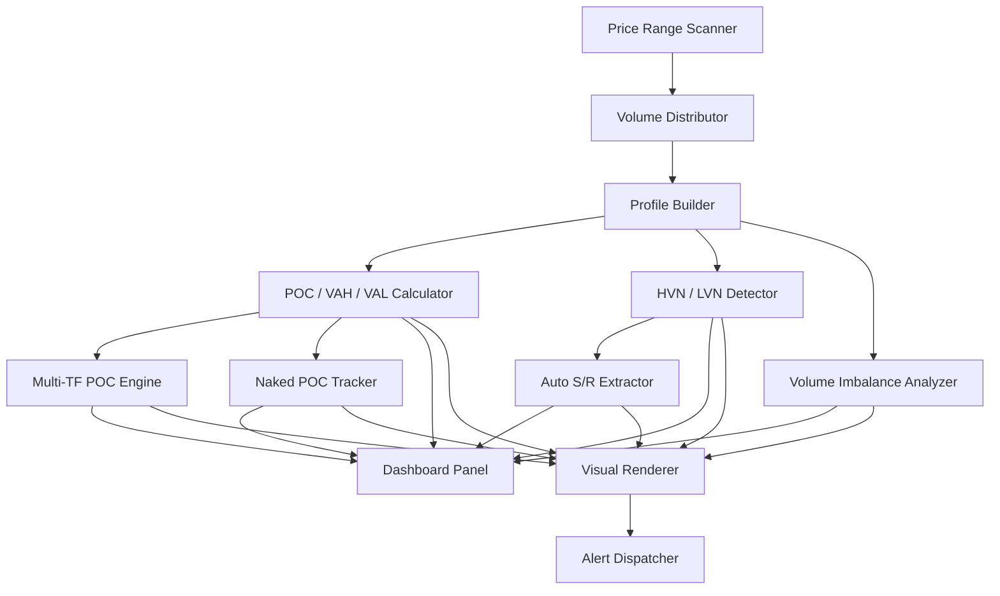
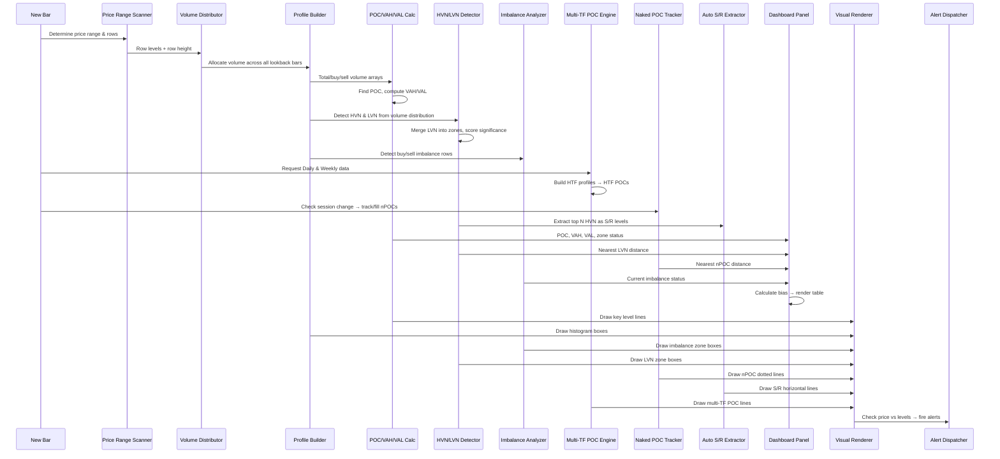

# Function Specification — SVP (PineScript v6)

## Module Architecture



---

## Module 1 — Price Range Scanner

Determines the price range and row structure for volume distribution.

### `f_get_price_range(mode, lookback_bars, num_sessions) → [float, float, int]`

| Param | Type | Description |
|---|---|---|
| `mode` | `string` | `"Fixed Bars"`, `"Session"`, or `"N Sessions"` |
| `lookback_bars` | `int` | Number of bars to scan (Fixed Bars mode) |
| `num_sessions` | `int` | Number of sessions to include (N Sessions mode) |
| **Returns** | `[float, float, int]` | `[range_high, range_low, start_bar_index]` |

**Logic:**
```
if mode == "Fixed Bars"
    range_high = ta.highest(high, lookback_bars)
    range_low  = ta.lowest(low, lookback_bars)
    start_bar  = bar_index - lookback_bars
else if mode == "Session"
    // Use session open bar as start
    range_high = ta.highest(high, bars_since_session_open)
    range_low  = ta.lowest(low, bars_since_session_open)
    start_bar  = session_open_bar_index
else if mode == "N Sessions"
    // Extend back N session boundaries
    range_high = highest across N sessions
    range_low  = lowest across N sessions
    start_bar  = N sessions back bar_index

return [range_high, range_low, start_bar]
```

---

### `f_build_row_levels(range_high, range_low, num_rows) → [float[], float]`

| Param | Type | Description |
|---|---|---|
| `range_high` | `float` | Top of the price range |
| `range_low` | `float` | Bottom of the price range |
| `num_rows` | `int` | Number of price rows (24–200) |
| **Returns** | `[float[], float]` | Array of row boundary prices, row height |

**Logic:**
```
row_height = (range_high - range_low) / num_rows
row_levels = array of (num_rows + 1) prices from range_low to range_high
    row_levels[i] = range_low + i * row_height
return [row_levels, row_height]
```

---

## Module 2 — Volume Distributor

Allocates each bar's volume proportionally across the price rows it spans.

### `f_allocate_volume(bar_high, bar_low, bar_volume, bar_close, bar_open, row_levels, row_height) → [float[], float[]]`

| Param | Type | Description |
|---|---|---|
| `bar_high` | `float` | Bar's high price |
| `bar_low` | `float` | Bar's low price |
| `bar_volume` | `float` | Bar's total volume |
| `bar_close` | `float` | Bar's close price |
| `bar_open` | `float` | Bar's open price |
| `row_levels` | `float[]` | Array of row boundary prices |
| `row_height` | `float` | Height of each row |
| **Returns** | `[float[], float[]]` | `[buy_volume_per_row, sell_volume_per_row]` |

**Logic:**
```
bar_range = bar_high - bar_low
if bar_range < 1e-10
    bar_range = row_height  // single-price bar: treat as 1 row width

is_buy = bar_close >= bar_open

for each row R from 0 to num_rows - 1:
    row_low  = row_levels[R]
    row_high = row_levels[R + 1]

    // Calculate overlap between bar range and row range
    overlap = max(0, min(bar_high, row_high) - max(bar_low, row_low))
    fraction = overlap / bar_range
    allocated = fraction * bar_volume

    if is_buy
        buy_volume[R]  += allocated
    else
        sell_volume[R] += allocated
```

**Performance Note:** This loop runs for every bar in the lookback × num_rows. With 200 bars × 50 rows = 10,000 iterations. Acceptable, but rows > 100 with lookback > 500 may hit Pine limits.

---

### `f_build_profile(lookback_bars, row_levels, row_height, num_rows) → [float[], float[], float[]]`

| Param | Type | Description |
|---|---|---|
| `lookback_bars` | `int` | Number of historical bars to process |
| `row_levels` | `float[]` | Row boundary prices |
| `row_height` | `float` | Height per row |
| `num_rows` | `int` | Total number of rows |
| **Returns** | `[float[], float[], float[]]` | `[total_vol, buy_vol, sell_vol]` — arrays of size `num_rows` |

**Logic:**
```
total_vol = array.new_float(num_rows, 0.0)
buy_vol   = array.new_float(num_rows, 0.0)
sell_vol  = array.new_float(num_rows, 0.0)

for i = 0 to lookback_bars - 1
    [buy_alloc, sell_alloc] = f_allocate_volume(
        high[i], low[i], volume[i], close[i], open[i],
        row_levels, row_height
    )
    for R = 0 to num_rows - 1
        array.set(buy_vol, R,  array.get(buy_vol, R) + buy_alloc[R])
        array.set(sell_vol, R, array.get(sell_vol, R) + sell_alloc[R])
        array.set(total_vol, R, array.get(buy_vol, R) + array.get(sell_vol, R))

return [total_vol, buy_vol, sell_vol]
```

---

## Module 3 — POC / VAH / VAL Calculator

Extracts the Point of Control and Value Area from the volume distribution.

### `f_find_poc(total_vol, row_levels, row_height) → [int, float]`

| Param | Type | Description |
|---|---|---|
| `total_vol` | `float[]` | Total volume per row |
| `row_levels` | `float[]` | Row boundary prices |
| `row_height` | `float` | Row height |
| **Returns** | `[int, float]` | `[poc_row_index, poc_price]` |

**Logic:**
```
max_vol = 0.0
poc_row = 0
for R = 0 to num_rows - 1
    if array.get(total_vol, R) > max_vol
        max_vol = array.get(total_vol, R)
        poc_row = R

poc_price = row_levels[poc_row] + row_height / 2.0  // midpoint of POC row
return [poc_row, poc_price]
```

---

### `f_find_value_area(total_vol, poc_row, value_area_pct, row_levels, row_height) → [float, float]`

| Param | Type | Description |
|---|---|---|
| `total_vol` | `float[]` | Total volume per row |
| `poc_row` | `int` | Index of the POC row |
| `value_area_pct` | `float` | Target percentage (e.g., 70.0) |
| `row_levels` | `float[]` | Row boundary prices |
| `row_height` | `float` | Row height |
| **Returns** | `[float, float]` | `[vah_price, val_price]` |

**Logic (Standard CME Method):**
```
total_volume = sum(total_vol)
target_volume = total_volume * (value_area_pct / 100.0)

// Start from POC and expand outward
va_volume = array.get(total_vol, poc_row)
upper_idx = poc_row
lower_idx = poc_row

while va_volume < target_volume
    // Look at the row above and below the current VA
    vol_above = (upper_idx + 1 < num_rows) ? array.get(total_vol, upper_idx + 1) : 0.0
    vol_below = (lower_idx - 1 >= 0) ? array.get(total_vol, lower_idx - 1) : 0.0

    if vol_above >= vol_below
        upper_idx += 1
        va_volume += vol_above
    else
        lower_idx -= 1
        va_volume += vol_below

    // Boundary check
    if upper_idx >= num_rows - 1 and lower_idx <= 0
        break

vah_price = row_levels[upper_idx + 1]    // top of upper row
val_price = row_levels[lower_idx]          // bottom of lower row
return [vah_price, val_price]
```

---

## Module 4 — HVN / LVN Detector

Identifies High Volume Nodes (congestion zones) and Low Volume Nodes (breakout highways).

### `f_detect_hvn_lvn(total_vol, row_levels, row_height, lvn_percentile) → [int[], int[], float]`

| Param | Type | Description |
|---|---|---|
| `total_vol` | `float[]` | Total volume per row |
| `row_levels` | `float[]` | Row boundary prices |
| `row_height` | `float` | Row height |
| `lvn_percentile` | `float` | Volume percentile threshold for LVN (e.g., 20.0) |
| **Returns** | `[int[], int[], float]` | `[hvn_rows, lvn_rows, lvn_threshold_vol]` |

**Logic:**
```
// Sort volumes to find percentile threshold
sorted_vols = array.copy(total_vol)
array.sort(sorted_vols, order.ascending)
lvn_threshold = array.get(sorted_vols, math.floor(num_rows * lvn_percentile / 100.0))

// Detect HVN: local maxima (volume > both neighbors)
hvn_rows = []
for R = 1 to num_rows - 2
    vol_curr = array.get(total_vol, R)
    vol_prev = array.get(total_vol, R - 1)
    vol_next = array.get(total_vol, R + 1)
    if vol_curr > vol_prev and vol_curr > vol_next
        array.push(hvn_rows, R)

// Detect LVN: rows below the percentile threshold
lvn_rows = []
for R = 0 to num_rows - 1
    if array.get(total_vol, R) <= lvn_threshold
        array.push(lvn_rows, R)

return [hvn_rows, lvn_rows, lvn_threshold]
```

---

### `f_merge_lvn_zones(lvn_rows, row_levels, row_height) → [float[], float[]]`

| Param | Type | Description |
|---|---|---|
| `lvn_rows` | `int[]` | Array of LVN row indices |
| `row_levels` | `float[]` | Row boundary prices |
| `row_height` | `float` | Row height |
| **Returns** | `[float[], float[]]` | `[zone_bottoms, zone_tops]` — merged contiguous LVN zones |

**Logic:**
```
// Merge consecutive LVN rows into zones
zones_bottom = []
zones_top = []

if array.size(lvn_rows) == 0
    return [zones_bottom, zones_top]

zone_start = array.get(lvn_rows, 0)
zone_end   = zone_start

for i = 1 to array.size(lvn_rows) - 1
    curr_row = array.get(lvn_rows, i)
    if curr_row == zone_end + 1
        zone_end = curr_row  // extend current zone
    else
        // Save previous zone and start new one
        array.push(zones_bottom, row_levels[zone_start])
        array.push(zones_top, row_levels[zone_end + 1])
        zone_start = curr_row
        zone_end = curr_row

// Save final zone
array.push(zones_bottom, row_levels[zone_start])
array.push(zones_top, row_levels[zone_end + 1])

return [zones_bottom, zones_top]
```

---

### `f_score_lvn(zone_bottom, zone_top, total_vol, row_levels, row_height) → float`

| Param | Type | Description |
|---|---|---|
| `zone_bottom` | `float` | LVN zone bottom price |
| `zone_top` | `float` | LVN zone top price |
| `total_vol` | `float[]` | Total volume per row |
| `row_levels` | `float[]` | Row boundary prices |
| `row_height` | `float` | Row height |
| **Returns** | `float` | Significance score (higher = more explosive breakout potential) |

**Logic:**
```
// Find the HVN volumes flanking this LVN zone
// Score = average flanking HVN volume / average LVN zone volume
// Higher ratio = more contrast = more explosive breakout

lvn_avg = average volume of rows within the LVN zone
upper_hvn_vol = volume of first HVN row above zone_top
lower_hvn_vol = volume of first HVN row below zone_bottom
flanking_avg = (upper_hvn_vol + lower_hvn_vol) / 2.0

score = flanking_avg / (lvn_avg + 1e-10)
return score
```

---

## Module 5 — Volume Imbalance Analyzer

Detects price levels where buy or sell volume heavily dominates.

### `f_detect_imbalance(buy_vol, sell_vol, total_vol, threshold, min_vol_pct, row_levels, row_height) → [int[], int[]]`

| Param | Type | Description |
|---|---|---|
| `buy_vol` | `float[]` | Buy volume per row |
| `sell_vol` | `float[]` | Sell volume per row |
| `total_vol` | `float[]` | Total volume per row |
| `threshold` | `float` | Imbalance threshold (e.g., 70.0 = 70%) |
| `min_vol_pct` | `float` | Minimum volume percentile for consideration |
| `row_levels` | `float[]` | Row boundary prices |
| `row_height` | `float` | Row height |
| **Returns** | `[int[], int[]]` | `[buy_imbalance_rows, sell_imbalance_rows]` |

**Logic:**
```
// Calculate minimum volume threshold
sorted_vols = array.copy(total_vol)
array.sort(sorted_vols, order.ascending)
min_vol = array.get(sorted_vols, math.floor(num_rows * min_vol_pct / 100.0))

buy_imbalance  = []
sell_imbalance = []

for R = 0 to num_rows - 1
    row_total = array.get(total_vol, R)
    if row_total < min_vol
        continue  // Skip low volume rows (noise filter)

    row_buy  = array.get(buy_vol, R)
    row_sell = array.get(sell_vol, R)
    buy_ratio = row_buy / row_total * 100.0

    if buy_ratio >= threshold
        array.push(buy_imbalance, R)
    else if buy_ratio <= (100.0 - threshold)
        array.push(sell_imbalance, R)

return [buy_imbalance, sell_imbalance]
```

---

## Module 6 — Multi-TF POC Engine

Computes POC from higher timeframe volume profiles.

### `f_htf_poc(timeframe, lookback, num_rows) → float`

| Param | Type | Description |
|---|---|---|
| `timeframe` | `string` | Higher timeframe resolution (e.g., `"D"`, `"W"`) |
| `lookback` | `int` | Number of bars in higher TF |
| `num_rows` | `int` | Number of price rows for HTF profile |
| **Returns** | `float` | POC price from the higher timeframe profile |

**Logic:**
```
htf_high   = request.security(syminfo.tickerid, timeframe, high, lookahead=barmerge.lookahead_off)
htf_low    = request.security(syminfo.tickerid, timeframe, low, lookahead=barmerge.lookahead_off)
htf_close  = request.security(syminfo.tickerid, timeframe, close, lookahead=barmerge.lookahead_off)
htf_open   = request.security(syminfo.tickerid, timeframe, open, lookahead=barmerge.lookahead_off)
htf_volume = request.security(syminfo.tickerid, timeframe, volume, lookahead=barmerge.lookahead_off)

// Build a simplified profile using HTF bars
[range_high, range_low] = [ta.highest(htf_high, lookback), ta.lowest(htf_low, lookback)]
[row_levels, row_height] = f_build_row_levels(range_high, range_low, num_rows)

// Allocate HTF volume across rows
[total_vol, _, _] = f_build_profile_htf(htf_high, htf_low, htf_volume, htf_close, htf_open, lookback, row_levels, row_height, num_rows)

[_, poc_price] = f_find_poc(total_vol, row_levels, row_height)
return poc_price
```

---

### `f_check_poc_confluence(session_poc, daily_poc, weekly_poc, atr) → bool`

| Param | Type | Description |
|---|---|---|
| `session_poc` | `float` | Current session POC |
| `daily_poc` | `float` | Daily POC |
| `weekly_poc` | `float` | Weekly POC |
| `atr` | `float` | Current ATR for proximity threshold |
| **Returns** | `bool` | True if 2+ POCs within 0.5 ATR of each other |

**Logic:**
```
threshold = 0.5 * atr
sd_close = math.abs(session_poc - daily_poc) <= threshold
sw_close = math.abs(session_poc - weekly_poc) <= threshold
dw_close = math.abs(daily_poc - weekly_poc) <= threshold

return sd_close or sw_close or dw_close
```

---

## Module 7 — Naked POC Tracker

Tracks unfilled POCs from previous sessions.

### `f_track_naked_pocs(session_changed, current_poc, max_count) → [float[], int[]]`

| Param | Type | Description |
|---|---|---|
| `session_changed` | `bool` | Whether a new session has started |
| `current_poc` | `float` | Current session's POC |
| `max_count` | `int` | Maximum nPOCs to track |
| **Returns** | `[float[], int[]]` | `[npoc_prices, npoc_bar_indices]` |

**Logic:**
```
var float[] npoc_prices = array.new_float(0)
var int[]   npoc_bars   = array.new_int(0)

// When a new session starts, save previous session's POC
if session_changed and not na(current_poc[1])
    if array.size(npoc_prices) >= max_count
        array.shift(npoc_prices)  // remove oldest
        array.shift(npoc_bars)
    array.push(npoc_prices, current_poc[1])
    array.push(npoc_bars, bar_index)

// Check if any nPOC has been "filled" (price touched it)
for i = array.size(npoc_prices) - 1 to 0
    npoc = array.get(npoc_prices, i)
    if low <= npoc and high >= npoc
        // Price has touched this nPOC — it's filled
        array.remove(npoc_prices, i)
        array.remove(npoc_bars, i)

return [npoc_prices, npoc_bars]
```

---

### `f_nearest_npoc(current_price, npoc_prices) → [float, float]`

| Param | Type | Description |
|---|---|---|
| `current_price` | `float` | Current close price |
| `npoc_prices` | `float[]` | Array of active Naked POC prices |
| **Returns** | `[float, float]` | `[nearest_npoc_price, distance]` |

**Logic:**
```
nearest = na
min_dist = 1e18

for i = 0 to array.size(npoc_prices) - 1
    npoc = array.get(npoc_prices, i)
    dist = math.abs(current_price - npoc)
    if dist < min_dist
        min_dist = dist
        nearest = npoc

return [nearest, min_dist]
```

---

## Module 8 — Auto S/R Extractor

Extracts the most significant HVN levels as support/resistance lines.

### `f_extract_sr_levels(hvn_rows, total_vol, row_levels, row_height, max_levels, min_strength) → [float[], float[]]`

| Param | Type | Description |
|---|---|---|
| `hvn_rows` | `int[]` | Array of HVN row indices |
| `total_vol` | `float[]` | Total volume per row |
| `row_levels` | `float[]` | Row boundary prices |
| `row_height` | `float` | Row height |
| `max_levels` | `int` | Maximum S/R levels to return |
| `min_strength` | `float` | Minimum volume multiple above median |
| **Returns** | `[float[], float[]]` | `[sr_prices, sr_volumes]` — sorted by volume descending |

**Logic:**
```
median_vol = array.median(total_vol)
threshold = median_vol * min_strength

// Filter HVNs by minimum strength
candidates_price = []
candidates_vol   = []

for i = 0 to array.size(hvn_rows) - 1
    row = array.get(hvn_rows, i)
    vol = array.get(total_vol, row)
    if vol >= threshold
        price = row_levels[row] + row_height / 2.0
        array.push(candidates_price, price)
        array.push(candidates_vol, vol)

// Sort by volume descending, take top N
// (Pine Script: manual sort using index array)
sr_prices = top N candidates by volume
sr_volumes = corresponding volumes

return [sr_prices, sr_volumes]
```

---

### `f_sr_strength_label(volume, max_volume) → string`

| Param | Type | Description |
|---|---|---|
| `volume` | `float` | Volume at this S/R level |
| `max_volume` | `float` | Maximum volume across all S/R levels |
| **Returns** | `string` | Strength indicator: `"★"`, `"★★"`, `"★★★"`, `"★★★★"`, `"★★★★★"` |

**Logic:**
```
ratio = volume / max_volume
if ratio >= 0.9 → return "★★★★★"
if ratio >= 0.7 → return "★★★★"
if ratio >= 0.5 → return "★★★"
if ratio >= 0.3 → return "★★"
return "★"
```

---

## Module 9 — Dashboard Panel

Compact real-time information panel displayed in a chart corner.

### `f_get_price_zone(close, vah, val, poc) → [string, color]`

| Param | Type | Description |
|---|---|---|
| `close` | `float` | Current price |
| `vah` | `float` | Value Area High |
| `val` | `float` | Value Area Low |
| `poc` | `float` | Point of Control |
| **Returns** | `[string, color]` | Zone description and color |

**Logic:**
```
if close > vah → return ["Above VAH ↑", bull_color]
if close < val → return ["Below VAL ↓", bear_color]
if close > poc → return ["Inside VA (Above POC)", neutral_bull_color]
return ["Inside VA (Below POC)", neutral_bear_color]
```

---

### `f_get_bias(close, poc, vah, val, buy_imb_near, sell_imb_near, hvn_above, hvn_below) → [string, color]`

| Param | Type | Description |
|---|---|---|
| `close` | `float` | Current price |
| `poc` / `vah` / `val` | `float` | Key levels |
| `buy_imb_near` | `bool` | Buy imbalance zone nearby below |
| `sell_imb_near` | `bool` | Sell imbalance zone nearby above |
| `hvn_above` / `hvn_below` | `float` | Nearest HVN above and below |
| **Returns** | `[string, color]` | Directional bias and color |

**Logic:**
```
bull_points = 0
bear_points = 0

if close > poc → bull_points += 1
if close > vah → bull_points += 1
if buy_imb_near → bull_points += 2   // institutional floor below
if close < poc → bear_points += 1
if close < val → bear_points += 1
if sell_imb_near → bear_points += 2  // institutional ceiling above

if bull_points > bear_points + 1 → return ["▲ Bullish", bull_color]
if bear_points > bull_points + 1 → return ["▼ Bearish", bear_color]
return ["— Neutral", neutral_color]
```

---

### Dashboard Layout

```
┌──────────────────────────────────┐
│  Smart Volume Profile [SVP]      │
├──────────┬───────────────────────┤
│ POC      │ 55.40                 │
│ VAH      │ 56.20                 │
│ VAL      │ 54.10                 │
│ Zone     │ Inside VA (Above POC) │
│ Near LVN │ ↑ 0.8 ATR            │
│ Near nPOC│ ↓ 1.2 ATR @ 53.80    │
│ Imbalance│ Buy Floor @ 54.00     │
│ Bias     │ ▲ Bullish             │
└──────────┴───────────────────────┘
```

---

## Module 10 — Visual Renderer

### Histogram Drawing

### `f_draw_histogram(total_vol, buy_vol, sell_vol, row_levels, row_height, poc_row, max_width) → void`

| Param | Type | Description |
|---|---|---|
| `total_vol` | `float[]` | Total volume per row |
| `buy_vol` | `float[]` | Buy volume per row |
| `sell_vol` | `float[]` | Sell volume per row |
| `row_levels` | `float[]` | Row boundary prices |
| `row_height` | `float` | Row height |
| `poc_row` | `int` | POC row index (for highlighting) |
| `max_width` | `int` | Maximum histogram bar width in bars |

**Logic:**
```
max_vol = array.max(total_vol)

// Clean up previous boxes
for each existing box → box.delete()

for R = 0 to num_rows - 1
    row_total = array.get(total_vol, R)
    row_buy   = array.get(buy_vol, R)
    row_sell  = array.get(sell_vol, R)

    // Scale width proportionally
    total_width = math.round(row_total / max_vol * max_width)
    buy_width   = math.round(row_buy / (row_total + 1e-10) * total_width)
    sell_width  = total_width - buy_width

    row_bottom = row_levels[R]
    row_top    = row_levels[R] + row_height

    anchor = bar_index + 2  // start histogram 2 bars right of last bar

    // Draw buy volume box (left portion)
    if buy_width > 0
        box.new(anchor, row_top, anchor + buy_width, row_bottom,
                bgcolor=color.new(buy_color, histogram_opacity),
                border_color=na)

    // Draw sell volume box (right portion, appended)
    if sell_width > 0
        box.new(anchor + buy_width, row_top, anchor + buy_width + sell_width, row_bottom,
                bgcolor=color.new(sell_color, histogram_opacity),
                border_color=na)

    // Highlight POC row
    if R == poc_row
        box.new(anchor, row_top, anchor + total_width, row_bottom,
                bgcolor=na, border_color=poc_color, border_width=2)
```

---

### Key Level Lines

### `f_draw_key_levels(poc, vah, val, settings) → void`

Draws horizontal lines for POC, VAH, and VAL across the full chart.

```
// Use line.new() with xloc=xloc.bar_time for full-width lines
// Or use line extending from start_bar to bar_index + offset

if show_poc
    line.new(start_bar, poc, bar_index + 50, poc,
             color=poc_color, width=poc_width, style=poc_style_enum)
    label.new(bar_index + 52, poc, "POC " + str.tostring(poc, format.mintick),
              style=label.style_label_left, color=poc_color, textcolor=color.white, size=size.tiny)

if show_vah_val
    line.new(start_bar, vah, bar_index + 50, vah,
             color=vah_color, width=1, style=line.style_dashed)
    line.new(start_bar, val, bar_index + 50, val,
             color=val_color, width=1, style=line.style_dashed)
```

---

### Imbalance Zone Boxes

### `f_draw_imbalance_zones(buy_rows, sell_rows, row_levels, row_height, start_bar, settings) → void`

```
for each row in buy_rows:
    box.new(start_bar, row_levels[row + 1], bar_index, row_levels[row],
            bgcolor=color.new(buy_imb_color, imb_opacity), border_color=na)

for each row in sell_rows:
    box.new(start_bar, row_levels[row + 1], bar_index, row_levels[row],
            bgcolor=color.new(sell_imb_color, imb_opacity), border_color=na)
```

---

### LVN Zone Boxes

### `f_draw_lvn_zones(zone_bottoms, zone_tops, start_bar, settings) → void`

```
for i = 0 to array.size(zone_bottoms) - 1
    box.new(start_bar, array.get(zone_tops, i), bar_index, array.get(zone_bottoms, i),
            bgcolor=color.new(lvn_color, lvn_opacity), border_color=color.new(lvn_color, lvn_opacity - 10))
```

---

## Module 11 — Alert Dispatcher

### `f_dispatch_alerts(close, poc, vah, val, lvn_zones, npoc_prices, imbalance_zones, atr) → void`

Fires alerts based on price interaction with key levels and zones.

**Logic:**
```
// POC touch
if close[1] != poc and close crosses poc
    alert("SVP: Price at POC (" + str.tostring(close) + ") on " + syminfo.ticker)

// VAH breakout
if close > vah and close[1] <= vah
    alert("SVP: Breakout above VAH on " + syminfo.ticker)

// VAL breakdown
if close < val and close[1] >= val
    alert("SVP: Breakdown below VAL on " + syminfo.ticker)

// LVN entry
for each lvn_zone:
    if close enters zone (was outside, now inside)
        alert("SVP: Price entering LVN zone — expect acceleration on " + syminfo.ticker)

// nPOC approach
[nearest_npoc, dist] = f_nearest_npoc(close, npoc_prices)
if dist <= npoc_alert_atr * atr
    alert("SVP: Price approaching Naked POC at " + str.tostring(nearest_npoc) + " on " + syminfo.ticker)

// Imbalance zone entry
if close enters buy_imbalance_zone
    alert("SVP: Price at Buy Imbalance zone (institutional floor) on " + syminfo.ticker)
if close enters sell_imbalance_zone
    alert("SVP: Price at Sell Imbalance zone (institutional ceiling) on " + syminfo.ticker)
```

---

## Execution Flow (Per Bar)



---

## PineScript v6 Considerations

| Topic | Approach |
|---|---|
| **Array management** | Heavy use of `array.new_float()`, `array.set()`, `array.get()`. Must clean up arrays each bar to avoid memory leaks. |
| **Box/Line limits** | TradingView limits `max_boxes_count` and `max_lines_count` to 500 each. Must delete old drawings before creating new ones. |
| **Loop performance** | Profile building requires nested loops (bars × rows). Keep `num_rows ≤ 100` and `lookback ≤ 500` for acceptable performance. |
| **`request.security()`** | Used for Multi-TF POC. Maximum 40 calls per script. We use 5 per timeframe × 2 TFs = 10 calls. |
| **`var` keyword** | Use `var` for persistent arrays (nPOC tracker, session tracking) to maintain state across bars. |
| **Box redrawing** | Delete and recreate all boxes on the last bar only (`barstate.islast`) to minimize rendering cost. |
| **Non-repainting** | All `request.security()` calls use `lookahead=barmerge.lookahead_off`. Profile only uses confirmed bar data (`close[0]` on confirmed bars). |
| **`max_bars_back`** | Set to accommodate the largest possible lookback (5000 bars). |
